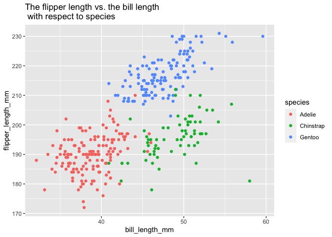

p8105\_hw1\_yw3773
================

``` r
library(tidyverse)
```

## Problem 1

``` r
# creating the data set
p1_df = tibble(
  num_vec = rnorm(10),
  logical_vec = num_vec > 0,
  char_vec = c('This', 'is', 'my', 'homework', 'one', 'in', 
               'data', 'science','and', 'yeah'),
  fac_vec = factor(c('high', 'median', 'low', 'high', 'high',
                     'low', 'low', 'median', 'median', 'high'))
)

# computing the mean
mean(pull(p1_df, num_vec))
```

    ## [1] -0.1727472

``` r
mean(pull(p1_df, logical_vec))
```

    ## [1] 0.5

``` r
mean(pull(p1_df, char_vec))
```

    ## Warning in mean.default(pull(p1_df, char_vec)): argument is not numeric or
    ## logical: returning NA

    ## [1] NA

``` r
mean(pull(p1_df,fac_vec))
```

    ## Warning in mean.default(pull(p1_df, fac_vec)): argument is not numeric or
    ## logical: returning NA

    ## [1] NA

After I create the data set, when I try to compute the mean, I can only
get the mean of the numeric vector and the logical vector. The mean for
the character vector and the factor vector shows NA with the error that
argument is not numeric or logical: returning NA.

When I try to convert the logical, character, and factor variables to
numeric variable, the logical and factor variables can be successfully
converted, but the character variable still shows NA. So the character
variable cannot be converted to numeric variable and we can not take the
mean of it. We can take the mean of logical variable, we can also take
the mean of the factor variable of we converted it into numeric.

``` r
as.numeric(pull(p1_df, logical_vec))
as.numeric(pull(p1_df, char_vec))
as.numeric(pull(p1_df, fac_vec))
mean(as.numeric(pull(p1_df, fac_vec)))
```

## Problem 2

``` r
# load the data
data("penguins", package = "palmerpenguins")
```

The penguins data set has 8 columns and 344 rows. The variables contains
8 variables which are species, island, bill\_length\_mm,
bill\_depth\_mm, flipper\_length\_mm, body\_mass\_g, sex, year. The mean
flipper length is 200.9152047 mm.

``` r
# make the plot
ggplot(penguins, aes(x = bill_length_mm, y = flipper_length_mm, color = species)) + geom_point() + ggtitle("The flipper length vs. the bill length \n with respect to species")
```

<!-- -->

``` r
ggsave("scatter_plot.pdf", height = 6, width = 5)
```
